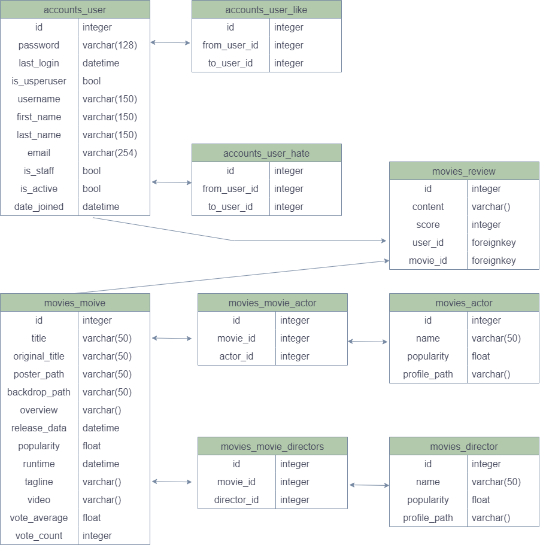
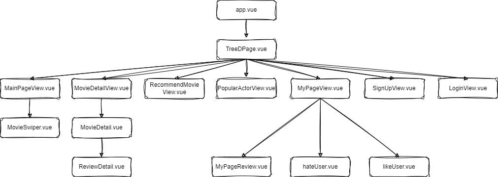

# 영화추천사이트 : noiZe
## 팀원 정보 및 업무 분담 내역
* 조장 : 전건휘
  - 서비스 기획, 모델 작성, 구현 기능
* 조원 : 정일규
  - 서비스 기획, 영화 추천 알고리즘, 구현 기능
## 목표 서비스 구현 및 실제 구현 정도
### 목표 서비스
1. 실시간 채팅
2. 영화 추천 알고리즘 3개 이상
3. 리뷰 CRUD
4. 별점
5. 유저 싫어요, 좋아요
6. 마이페이지 구현
7. 마이페이지 차단
8. 3D 모델링 구현
9. 영화 포스터 스와이퍼로 동적 움직임 구현
10. 검색창에서 영화 디테일 페이지로 이동
11. 장르, 키워드 모델링
12. 장르, 키워드 검색을 통해 관련 영화들 보여주기
### 실제 구현
1. 실시간 채팅
2. 영화 추천 알고리즘 3개 이상
3. 리뷰 CRUD
4. 별점
5. 유저 싫어요, 좋아요
6. 마이페이지 구현
7. 마이페이지 차단
8. 3D 모델링 구현
9. 영화 포스터 스와이퍼로 동적 움직임 구현
10. 검색창에서 영화 디테일 페이지로 이동
## 데이터베이스 모델링 (ERD)

## 컴포넌트 구조

## 영화 추천 알고리즘에 대한 기술적 설명
### 인기도 알고리즘
```python
# 영화 인기도 순
@api_view(['GET'])
def popularity_recommend_movie(request):
    # 영화를 인기도(popularity) 기준으로 내림차순 정렬하여 가져옵니다.
    recommended_movies = Movie.objects.all().order_by('-popularity')[:16]

    # 가져온 영화 정보를 시리얼라이즈합니다.
    serializer = MovieListSerializer(recommended_movies, many=True)

    return JsonResponse(serializer.data, safe=False)
```
### 출연 배우 인기도 평균 알고리즘
```python
 # 배우 인기도 평균 순서로 정렬한 영화 추천 
@api_view(['GET'])
def actor_population_movies(request):
    # 전체 영화 목록 가져오기
    movies = Movie.objects.all()

    # 모든 영화에 출연한 배우들의 인기도를 평균내서 정렬
    related_movies = (
        Movie.objects.annotate(average_actor_popularity=Avg('actors__popularity'))
        .order_by('-average_actor_popularity')[:16]
    )

    # 시리얼라이즈
    result_data = []
    for related_movie in related_movies:
        result_data.append({
            'id': related_movie.pk,
            'title': related_movie.title,
            'average_actor_popularity': related_movie.average_actor_popularity,
            'poster_path': related_movie.poster_path
        })

    return Response({'related_movies': result_data})
```
### 감독 인기도 알고리즘
```python
# 감독 인기도 평균 순서로 정렬한 영화 추천
@api_view(['GET'])
def director_population_movies(request):
    # 전체 영화 목록 가져오기
    movies = Movie.objects.all()

    # 모든 영화에 제작진으로 참여한 감독들의 인기도를 평균내서 정렬
    related_movies = (
        Movie.objects.annotate(average_director_popularity=Avg('directors__popularity'))
        .order_by('-average_director_popularity')[:16]
    )

    # 시리얼라이즈
    result_data = []
    for related_movie in related_movies:
        result_data.append({
            'id': related_movie.pk,
            'title': related_movie.title,
            'average_director_popularity': related_movie.average_director_popularity,
            'poster_path': related_movie.poster_path
        })

    return Response({'related_movies': result_data})
```
### 최신 영화 기준 알고리즘
```python
 # 최신영화순서
@api_view(['GET'])
def latest_movie(request):
    print('안녕하세요 최신무비입니다.')
    today = datetime.now().date()

    # 오늘 이전에 개봉한 영화를 최신순으로 10개 가져옵니다.
    movies = Movie.objects.filter(release_date__lt=today).order_by('-release_date')[:10]

    # 가져온 영화 정보를 시리얼라이즈합니다.
    serialized_movies = []
    for movie in movies:
        # release_date를 문자열에서 datetime 객체로 변환합니다.
        movie.release_date = datetime.strptime(movie.release_date, "%Y-%m-%d").date()
        serialized_movies.append(movie)

    serializer = MovieListSerializer(serialized_movies, many=True)
    return Response(serializer.data)
```
## 서비스 대표 기능에 대한 설명
* 영화를 보고 나서 실시간으로 영화에 대한 이야기를 할 수 있는 공간을 만들었습니다.
## 프로젝트 구동 순서
### back
1. python -m venv venv
2. source venv/Scripts/activate
3. pip install -r requirements.txt
4. pip install -r requirements2.txt (중간에 프로젝트들을 합치다 보니 누락된 라이브러리를 만들지 않기 위해)
5. docker run --rm -p 6379:6379 redis:7 (실시간 채팅 구현을 위해 사전 도커 설정이 필요)
6. python manage.py runserver
### front
1. npm install
2. npm run dev
## 후기
### 전건휘
초반에 처음 들어가는 프로젝트에 겁이 나서 더 많은 모델을 만들고 더 많은 api데이터를 추출해 놓지 않은 것이 후회된다. 프로젝트 중간에는 진행중인 프로젝트가 충돌날까봐 모델을 수정하지 못했다. 처음 해보는 프로젝트이다 보니 일정을 어떻게 짜야되는지 알지 못해 너무 일정을 초조하게 잡아 시간관리를 못해 아쉬웠다. 그래도 처음으로 하는 프로젝트를 완성했다는 점에서 만족한다.
### 정일규
시간이 조금만 더 있었으면 원하는 기능들을 더 많이 구현할 수 있었을 것 같다. 금융파트에 비해 필수 조건이 적다 보니 하고 싶은 기능들을 구현하는 데 더 집중했는 데 프로젝트 완료까지 시간이 넉넉치 않다 보니 새로 알게된 기능들을 자세히 공부하고 이해한 후에 적용하기 보다는 일단 기능 적용에만 신경쓴것 같아 아쉬웠다.